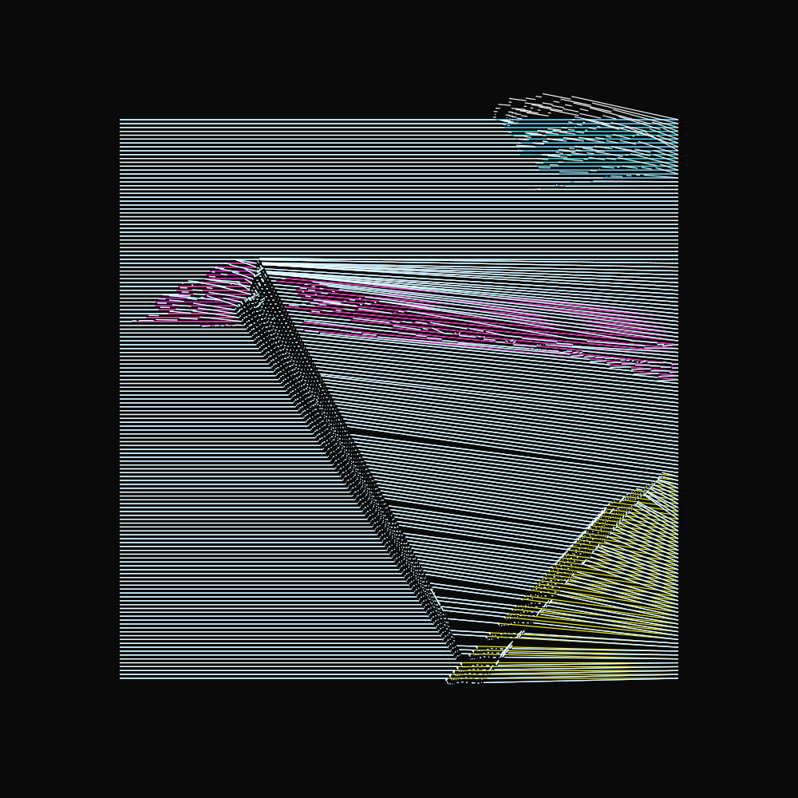
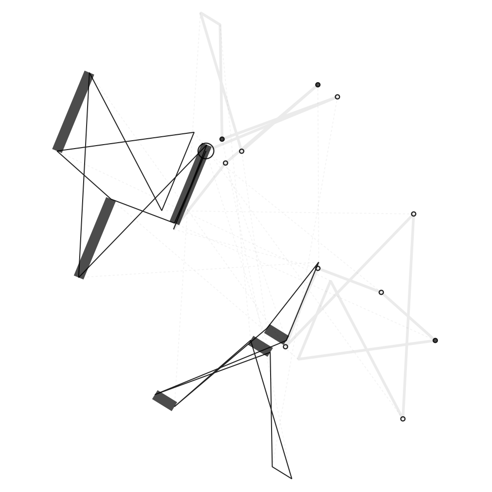

# GRPH


## About

`grph` is an in-memory immutable graph structure with
[Datalog](https://en.wikipedia.org/wiki/Datalog) query language. The data
structure and interfaces are generic, but it is primarily intended to
be used in my generative art experiments.

The main features is that the graph data structure builds on
[fset](https://fset.common-lisp.dev/) in order to be immutable. Furthermore, in
`grph` the edge properties (`props`) is a native part of the graph itself.  The
graph topology is separated from the spatial data, and the spatial data is also
immutable. Having a separation between the graph and the spatial information
makes it easier to work with higher dimensional data.

There are many benefits to having immutable data structures; perhaps the most
interesting being that it makes it trivial to to create transactions.

I have written about this library at

 - https://inconvergent.net/2022/graph-data-structure-with-datalog-ql/
 - (more to come)





## Components

The `grph` system has two packages:

1. `grph` contains the graph structure, as well as the query interface (Datalog
   compiler).
2. `xgrph` expands `grph` with some spatial awareness.

See the [docs folder](docs) for auomatically generated docs (incomplete).


## Examples

The subset of Datalog currently supported in `grph` is the most basic pattern
matching using `and`, `or`, `not`, `or-join` and `not-join`. Rules/fixed-point
iteration is supported in `grph:rqry`. See examples.

Here is a small example that demonstrates a few supported Datalog queries for a
small graph:

Further examples and explanations are included in the [examples
folder](examples).

```lisp
(in-package :grph)

(let ((g (ingest-edges (grph)
         '((0 :A 1) (0 :C 1) (1 :A 0) (1 :A 2) (1 :A 3) (1 :C 0)
           (2 :A 1) (3 :A 1) (3 :B 4) (3 :B 5) (3 :C 5) (3 :C 7)
           (4 :B 3) (4 :B 5) (4 :E 5) (5 :B 3) (5 :B 4) (5 :C 3)
           (7 :C 3)))))

(veq:vpr (qry g :select (?x ?y)
                :where (and (?x :a ?y) (?x :c ?y))))
;> '((1 0) (0 1))

(veq:vpr (qry g :select (?x ?y)
                :where (and (?x :c ?y)
                            (not (or (?x :a 1) (?x :a 3))))))
;> '((7 3) (5 3))

(let ((?x 5))
  (veq:vpr (qry g :in ?x ; bind ?x to the "outside" value: 5
                  :select ?y
                  :where (or (?x :b ?y)
                             (?x :a ?y)))))
;> '((3) (4))

(veq:vpr (qry g :select ?r
                :where (or-join ?r
                         (and (?r :a ?a) (?a :b 5))
                         (?r :c 0)
                         (?r :e 5)))))
;> '((4) (1)))
```




## Dependencies

  - [cl-veq](https://github.com/inconvergent/cl-veq). Must be installed from
    the Github repo (not quicklisp).
  - [fset](https://fset.common-lisp.dev/). Automatically installed via
    quicklisp.
  - [lparallel](https://lparallel.org/). Not required by default, but some
    queries can be significantly faster when `grph` is loaded with
    `:grph-parallel` in `*feautures*`; in which case `lparallel` will be
    automatically installed via quicklisp.
  - [auxin](https://github.com/inconvergent/auxin). Some of the examples depend
    on `auxin`. But the `grph` system does not require `auxin` directly.


## Tests

Tests can be executed with `(asdf:test-system :grph)`. Or by executing
`./run-tests.sh`.

## Note

This code is likely to change with little or no warning. You should not use
this for anything remotely important. Make sure to fork the repository if you
need it to remain stable.

